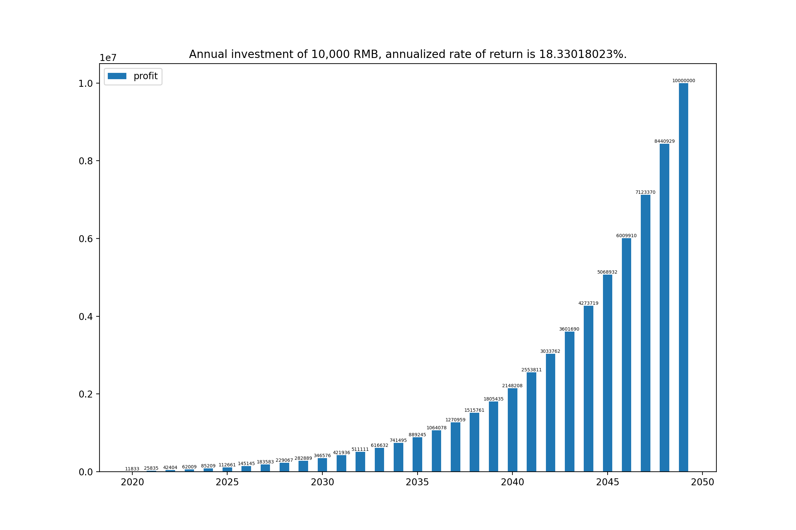

|年份|投资金额|结算日期|本期结余|收益金额|收益总额|年化收益|累计收益|目标差值|
|:-:|:-:|:-:|:-:|:-:|:-:|:-:|:-:|:-:|
|2020|10000|-|-|-|-|-|-|-|
|2021|10000|-|-|-|-|-|-|-|
|2022|10000|-|-|-|-|-|-|-|
|2023|10000|-|-|-|-|-|-|-|
|2024|10000|-|-|-|-|-|-|-|
|2025|10000|-|-|-|-|-|-|-|
|2026|10000|-|-|-|-|-|-|-|
|2027|10000|-|-|-|-|-|-|-|
|2028|10000|-|-|-|-|-|-|-|
|2029|10000|-|-|-|-|-|-|-|
|2030|10000|-|-|-|-|-|-|-|
|2031|10000|-|-|-|-|-|-|-|
|2032|10000|-|-|-|-|-|-|-|
|2033|10000|-|-|-|-|-|-|-|
|2034|10000|-|-|-|-|-|-|-|
|2035|10000|-|-|-|-|-|-|-|
|2036|10000|-|-|-|-|-|-|-|
|2037|10000|-|-|-|-|-|-|-|
|2038|10000|-|-|-|-|-|-|-|
|2039|10000|-|-|-|-|-|-|-|
|2040|10000|-|-|-|-|-|-|-|
|2041|10000|-|-|-|-|-|-|-|
|2042|10000|-|-|-|-|-|-|-|
|2043|10000|-|-|-|-|-|-|-|
|2044|10000|-|-|-|-|-|-|-|
|2045|10000|-|-|-|-|-|-|-|
|2046|10000|-|-|-|-|-|-|-|
|2047|10000|-|-|-|-|-|-|-|
|2048|10000|-|-|-|-|-|-|-|
|2049|10000|-|-|-|-|-|-|-|

